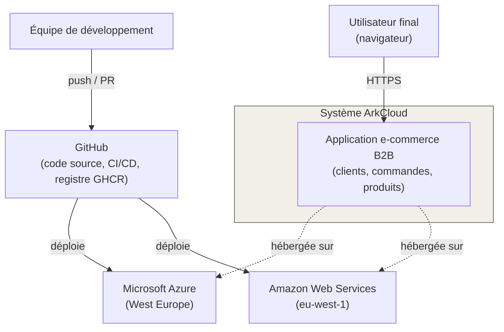
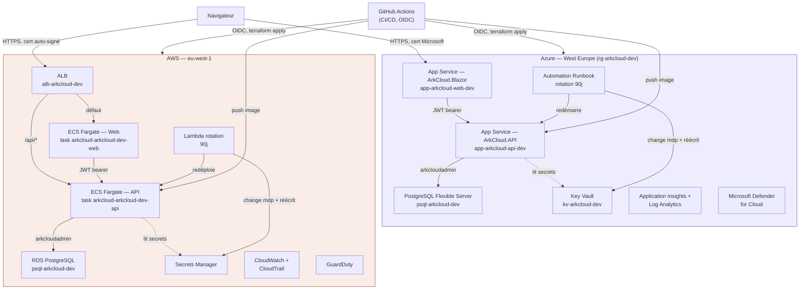
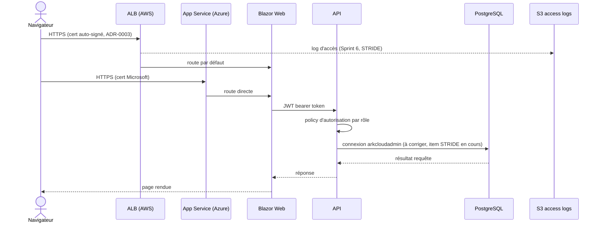
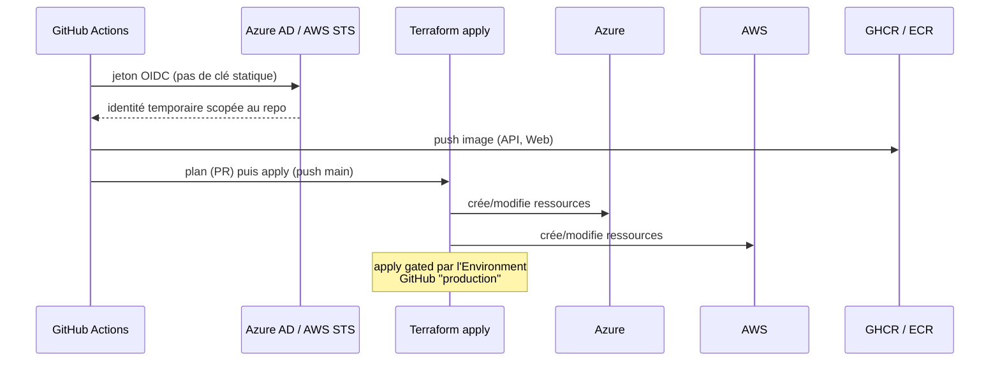
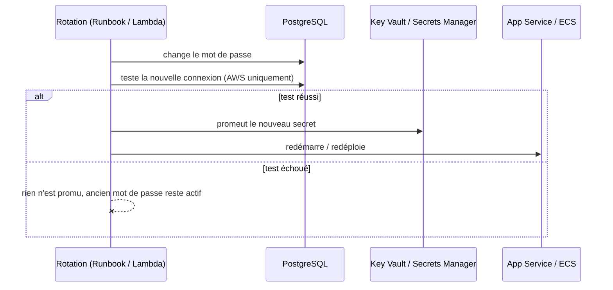
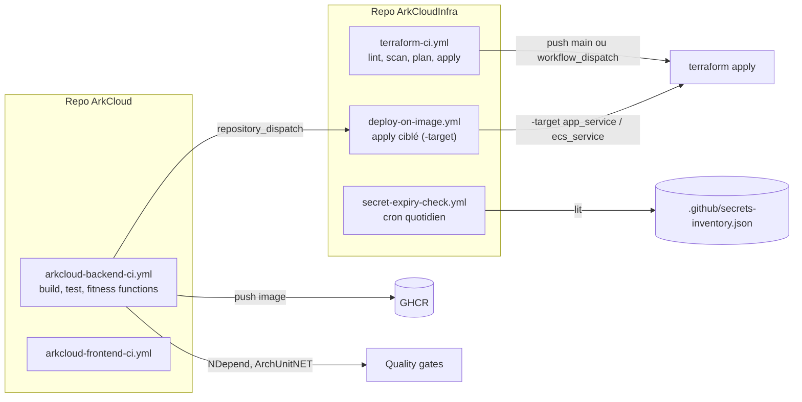
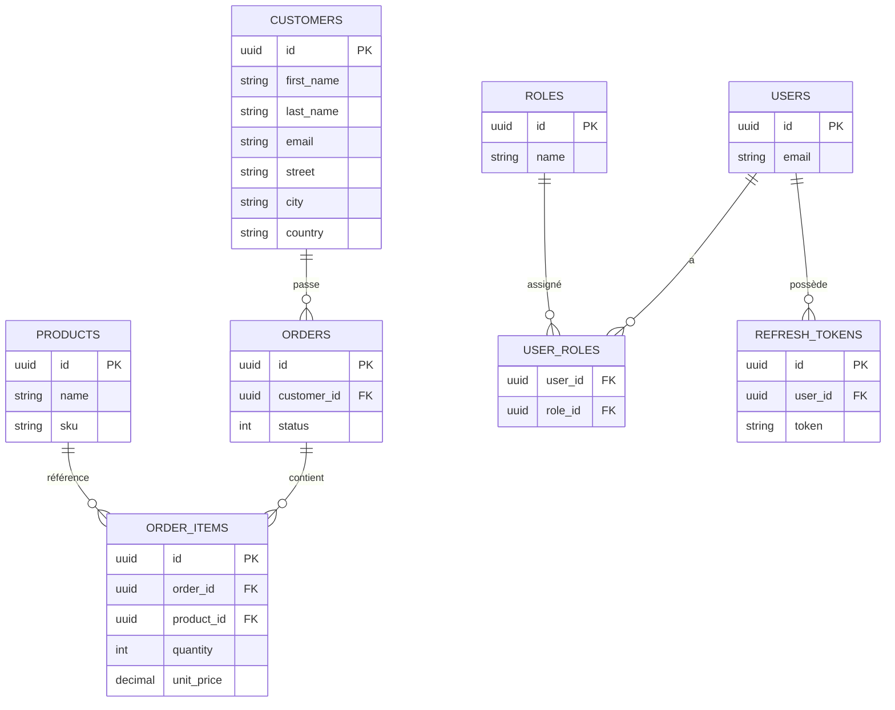

# Architecture ArkCloud — document de référence

> Document de référence technique, du plus général (vue d'ensemble) au plus spécifique (chaque flux, chaque module Terraform, chaque table). Généré à partir de l'état réel du code et de l'infrastructure au 27/08/2026 — pas un document théorique, chaque affirmation ici est vérifiable dans le repo (`ArkCloud` et `ArkCloudInfra`) ou dans les ADR/roadmap qui l'accompagnent.

---

## 1. Historique du projet

| Sprint | Contenu | Statut |
|---|---|---|
| 1 | Cadrage, backend .NET 10 (Domain / Application / Infrastructure / API), scaffold initial | ✅ Clôturé |
| 2 | Qualité backend — tests unitaires, conventions de code | ✅ Clôturé |
| 3 | Authentification JWT, frontend Blazor Server | ✅ Clôturé |
| 4 | CI/CD GitHub Actions + infrastructure Azure (App Service, PostgreSQL Flexible Server, Key Vault, Application Insights) | ✅ Clôturé (28/07/2026) |
| 5 | Infrastructure AWS en parallèle (VPC, ECS Fargate, RDS PostgreSQL, ALB, CloudTrail, monitoring) — double-cloud actif | ✅ Clôturé |
| 6 | Sécurité cloud avancée : NSG flow logs, HTTPS/ACM, rotation automatique des secrets, GuardDuty, Defender for Cloud, audit IAM, fitness functions (ArchUnitNET, infracost), STRIDE, RGPD, ADR, SBOM, versionning | 🔄 En cours |
| 7 | Angular enterprise | ⏳ À venir |
| 8 | Microservices, Kafka, résilience, traçabilité distribuée | ⏳ À venir |
| 9 | Kubernetes (AKS/EKS) | ⏳ À venir |
| 10 | SRE / plateforme, chaos engineering | ⏳ À venir |
| 11 | Adoption TOGAF 10.0 | ⏳ À venir |

Décision structurante prise en Sprint 5 (ADR-0005, migration non commencée) : ArkCloud vise une architecture cible **primaire + DR** répartie sur deux clouds plutôt qu'un seul — c'est pour ça que Azure et AWS hébergent chacun une pile applicative complète et indépendante depuis le Sprint 5, pas juste un environnement de test parallèle.

Versionning (ADR-0009, Sprint 6) : modèle trunk-based allégé — `develop` reste la branche d'intégration continue, `main` est protégée (PR + CI obligatoires) et n'est mise à jour qu'à la clôture d'un sprint ou d'un jalon stable. SemVer démarré à `v0.1.0`, `0.x` signifiant explicitement l'absence de garantie de stabilité à ce stade.

---

## 2. Vue d'ensemble (contexte système)

ArkCloud est une application e-commerce B2B (gestion clients/commandes/produits) volontairement déployée en double-cloud actif — pas un site principal + un site de secours passif, mais deux piles applicatives complètes et indépendantes (Azure et AWS), chacune avec son propre frontend, API, base de données et secrets. L'objectif pédagogique et technique du projet est de couvrir l'éventail complet d'un système d'entreprise réel : sécurité, conformité, observabilité, gouvernance, jusqu'aux microservices et à Kubernetes dans les sprints à venir.

---

## 3. Vue conteneurs — les deux piles cloud

Point notable, volontaire : les deux clouds ne sont pas symétriques dans leur mécanique interne (Azure utilise un Automation Runbook PowerShell, AWS une Lambda Python custom pour la rotation des secrets ; Azure route par hostname séparé, AWS par path-based routing sur un seul ALB) — même politique de sécurité, mécanismes différents parce que les plateformes n'offrent pas les mêmes primitives natives.

---

## 4. Inventaire des modules Terraform (`ArkCloudInfra`)

| Module | Cloud | Rôle |
|---|---|---|
| `resource_group` | Azure | Groupe de ressources `rg-arkcloud-dev` |
| `network` | Azure | VNet, subnets, NSG |
| `postgresql` | Azure | PostgreSQL Flexible Server |
| `key_vault` | Azure | Coffre de secrets (RBAC, purge protection) |
| `monitoring` | Azure | Application Insights, Log Analytics, diagnostic settings |
| `app_service_api` / `app_service_web` | Azure | App Services (API, Blazor) |
| `keyvault_access_api` | Azure | Accès RBAC de l'API au Key Vault |
| `azure_cost_guard` | Azure | Garde-fou budget (7 €/mois), arrêt auto Postgres |
| `azure_secret_rotation` | Azure | Automation Runbook, rotation Postgres 90j |
| `flow_logs` | Azure | NSG flow logs → Storage Account |
| `azure_defender` | Azure | Microsoft Defender for Cloud (Key Vault actif par défaut) |
| `aws_vpc` | AWS | VPC, subnets publics/privés, NAT Gateway |
| `aws_security` | AWS | Security groups (ALB, ECS, base) |
| `aws_rds` | AWS | RDS PostgreSQL |
| `aws_secrets` | AWS | Secrets Manager (JWT, connexion DB) |
| `aws_ecr` | AWS | Registre d'images (provisoire, ADR-0002) |
| `aws_ecs` | AWS | Cluster ECS Fargate |
| `aws_alb` | AWS | Application Load Balancer, TLS, **logs d'accès S3 (Sprint 6)** |
| `aws_ecs_service_api` / `aws_ecs_service_web` | AWS | Services ECS (API, Web) |
| `aws_cloudtrail` | AWS | Audit trail, bucket S3 dédié |
| `aws_monitoring` | AWS | CloudWatch, alarmes, dashboard, SNS |
| `aws_secret_rotation` | AWS | Lambda custom, rotation Postgres 90j |
| `aws_guardduty` | AWS | Détection de menaces (compte/région) |

24 modules au total, répartis en deux environnements indépendants (`environments/dev`, un seul à ce jour — staging/prod prévus Sprints 9-10) mais un seul state Terraform partagé entre les deux clouds.

---

## 5. Flux détaillés (modélisation STRIDE, Sprint 6)

Chaque flux ci-dessous correspond à une ligne du threat model (`docs/threat-model-stride.md`) — la séquence complète d'une requête, de bout en bout, avec les frontières de confiance traversées.

### Résumé STRIDE — état réel au 27/08/2026

| Flux | Menace | État |
|---|---|---|
| 1. Navigateur → ALB/App Service | Certificat auto-signé (AWS) | Acceptée — ADR-0003 |
| 1. Navigateur → ALB/App Service | Logs d'accès ALB absents | **Mitigée (Sprint 6)** |
| 1. Navigateur → ALB/App Service | Pas de rate limiting infra | Acceptée pour l'instant — ADR-0008 |
| 3. API → base | Compte applicatif trop privilégié | **En cours de correction** (rôle `arkcloud_app`) |
| 3. API → base | Données personnelles dans les logs | Mitigée (Sprint 6, `AuthService.cs`) |
| 4. CI → cloud | `GHCR_PAT`, secret humain | Acceptée — ADR-0007, rotation automatisée depuis Sprint 6 |
| 5. Rotation → base | Restaurabilité après rotation jamais testée | À traiter |

---

## 6. Pipelines CI/CD

`terraform-ci.yml` a été modifié au Sprint 6 pour que `workflow_dispatch` puisse aussi déclencher un vrai `apply` (auparavant limité au `plan`) — nécessaire pour que la rotation automatisée de `GHCR_PAT` (`scripts/rotate-ghcr-pat.ps1`) puisse réellement repropager le secret sans attendre un push sur `main`.

---

## 7. Modèle de données

Issu de 4 migrations EF Core réelles (`InitialCreate`, `AddAuthentication`, `AddCreatedAtTimestamps`, `AddProductStockAndCategory`). Point ouvert, identifié pendant le chantier RGPD : `orders.customer_id` reste orphelin quand un client est supprimé (droit à l'effacement incomplet, `docs/rgpd-classification-donnees.md`).

---

## 8. Gouvernance et décisions d'architecture

| ADR | Décision | Statut |
|---|---|---|
| 0001 | Terraform dans un repo séparé (`ArkCloudInfra`) | Acceptée |
| 0002 | Amazon ECR provisoire plutôt que JFrog | Acceptée |
| 0003 | Certificat auto-signé sur l'ALB AWS | Acceptée (temporaire) |
| 0004 | Rotation automatique sélective des secrets | Acceptée |
| 0005 | Architecture cible Azure/AWS — primaire + DR | Acceptée (migration non commencée) |
| 0007 | `GHCR_PAT` — risque accepté | Acceptée |
| 0008 | Rate limiting applicatif seul, rien en infra | Acceptée (temporaire) |
| 0009 | Stratégie de branches et de versionning | Acceptée |

*(0006 réservée — la rotation `Jwt:Key` est couverte par l'ADR-0004, le numéro n'est pas réattribué.)*

Outillage qualité/architecture (Sprint 6, en cours) : ArchUnitNET (fitness functions de couche, en CI), infracost (garde-fou coût sur les plans Terraform), essai NDepend (28 jours, ne sera pas conservé au-delà — un faux positif connu du style top-level statements y a été trouvé et documenté plutôt que corrigé). SonarQube/SonarCloud, Snyk et Renovate restent à mettre en place, un par un.

---

## 9. Prochaines étapes (Sprint 6, reste à faire)

- Clôturer les 2 items STRIDE restants : revue des privilèges SQL (`arkcloud_app`, en cours), drill de restauration après rotation.
- SBOM (Syft) + signature d'images (Cosign).
- Purge automatique après la fenêtre de rétention RGPD, correction de `orders.customer_id` orphelin.
- SonarCloud, Snyk, Renovate.
- Merge `develop` → `main` + tag SemVer à la clôture du sprint.
