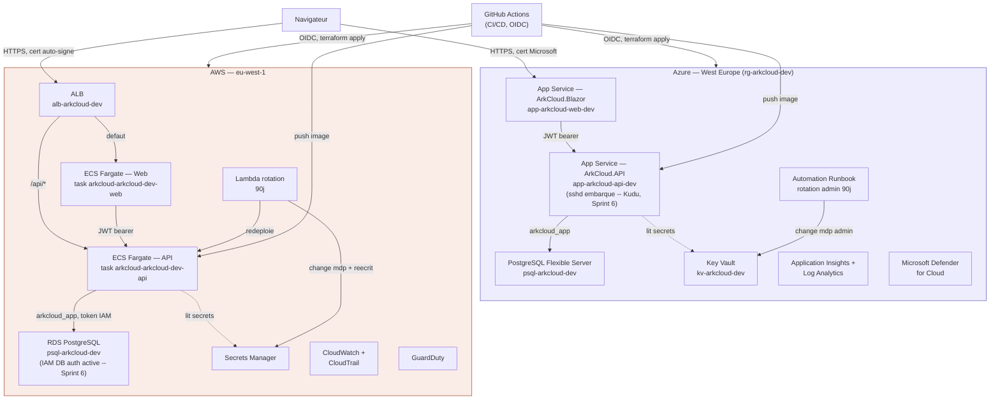

# Architecture ArkCloud — document de référence

> Document de référence technique, du plus général (vue d'ensemble) au plus spécifique (chaque flux, chaque module Terraform, chaque table). Généré à partir de l'état réel du code et de l'infrastructure au **12/09/2026** — pas un document théorique, chaque affirmation ici est vérifiable dans le repo (`ArkCloud` et `ArkCloudInfra`) ou dans les ADR/roadmap qui l'accompagnent. Remplace la version du 27/08/2026, qui ne couvrait pas les chantiers de sécurité de fin de Sprint 6 (authentification passwordless AWS, rotation `arkcloud_app` via Kudu côté Azure, démontage du Function App expérimental, rotation admin Postgres Azure).

---

## 1. Résumé exécutif

Le Sprint 6 ("Sécurité cloud avancée") est en voie de clôture. Les chantiers STRIDE, IAM moindre-privilège, rotation de secrets, observabilité et gouvernance documentaire sont tous fonctionnellement terminés et vérifiés en conditions réelles — pas seulement planifiés côté Terraform. Les deux items les plus délicats de la semaine (authentification passwordless AWS pour `arkcloud_app`, et la procédure de rotation manuelle Azure via Kudu) ont été bloqués, diagnostiqués puis débloqués avec des causes racines réelles trouvées à chaque étape.

Statut global : 7 tâches ouvertes closes cette semaine (passwordless AWS, Kudu, démontage du Function App, rotation `arkcloud_app`, rotation admin Postgres Azure, clés Log Analytics, régénération de ce document), zéro tâche bloquante restante sur le Sprint 6.

---

## 2. Historique du projet

| Sprint | Contenu | Statut |
|---|---|---|
| 1 | Cadrage, backend .NET 10 (Domain / Application / Infrastructure / API), scaffold initial | ✅ Clôturé |
| 2 | Qualité backend — tests unitaires, conventions de code | ✅ Clôturé |
| 3 | Authentification JWT, frontend Blazor Server | ✅ Clôturé |
| 4 | CI/CD GitHub Actions + infrastructure Azure (App Service, PostgreSQL Flexible Server, Key Vault, Application Insights) | ✅ Clôturé (28/07/2026) |
| 5 | Infrastructure AWS en parallèle (VPC, ECS Fargate, RDS PostgreSQL, ALB, CloudTrail, monitoring) — double-cloud actif | ✅ Clôturé |
| 6 | Sécurité cloud avancée : NSG flow logs, HTTPS/ACM, rotation automatique des secrets, GuardDuty, Defender for Cloud, audit IAM, fitness functions, STRIDE, RGPD, ADR, passwordless AWS, rotation Azure via Kudu | 🔄 En voie de clôture |
| 7 | Angular enterprise | ⏳ À venir |
| 8 | Microservices, Kafka, résilience, traçabilité distribuée | ⏳ À venir |
| 9 | Kubernetes (AKS/EKS) | ⏳ À venir |
| 10 | SRE / plateforme, chaos engineering | ⏳ À venir |
| 11 | Adoption TOGAF 10.0 | ⏳ À venir |

Décision structurante (ADR-0005, Sprint 5, migration non commencée) : ArkCloud vise une architecture cible primaire + DR répartie sur deux clouds plutôt qu'un seul — Azure et AWS hébergent chacun une pile applicative complète et indépendante depuis le Sprint 5.

Versionning (ADR-0009) : modèle trunk-based allégé — `develop` est la branche d'intégration continue, `main` est protégée (PR + CI obligatoires). SemVer démarré à `v0.1.0`.

---

## 3. Architecture — vue d'ensemble

ArkCloud est une application e-commerce B2B (clients / commandes / produits) déployée en double-cloud actif : deux piles applicatives complètes et indépendantes, chacune avec son frontend, son API, sa base de données et ses secrets. Point notable, volontaire : les deux clouds ne sont pas symétriques dans leur mécanique interne — Azure et AWS n'offrent pas les mêmes primitives natives, donc les mécanismes diffèrent (détaillé §5-6).

---

## 4. Inventaire des modules Terraform (`ArkCloudInfra`)

23 modules au total (le module Azure Functions expérimental a été démonté cette semaine, voir §6), répartis dans `environments/dev` (staging/prod prévus Sprints 9-10), un seul state Terraform partagé entre les deux clouds.

| Module | Cloud | Rôle |
|---|---|---|
| `resource_group` | Azure | Groupe de ressources `rg-arkcloud-dev` |
| `network` | Azure | VNet, subnets, NSG |
| `postgresql` | Azure | PostgreSQL Flexible Server |
| `key_vault` | Azure | Coffre de secrets (RBAC, purge protection) |
| `monitoring` | Azure | Application Insights, Log Analytics, diagnostic settings |
| `app_service_api` / `app_service_web` | Azure | App Services (API, Blazor) |
| `keyvault_access_api` | Azure | Accès RBAC de l'API au Key Vault |
| `azure_cost_guard` | Azure | Garde-fou budget (7 €/mois), arrêt auto Postgres |
| `azure_secret_rotation` | Azure | Automation Runbook, rotation admin Postgres 90j |
| `flow_logs` | Azure | NSG flow logs → Storage Account |
| `azure_defender` | Azure | Microsoft Defender for Cloud |
| `aws_vpc` | AWS | VPC, subnets publics/privés, NAT Gateway |
| `aws_security` | AWS | Security groups (ALB, ECS, base) |
| `aws_rds` | AWS | RDS PostgreSQL (IAM DB auth activée, Sprint 6) |
| `aws_secrets` | AWS | Secrets Manager (JWT, connexion DB, `arkcloud_app`) |
| `aws_ecr` | AWS | Registre d'images (provisoire, ADR-0002) |
| `aws_ecs` | AWS | Cluster ECS Fargate |
| `aws_alb` | AWS | Application Load Balancer, TLS, logs d'accès S3 |
| `aws_ecs_service_api` / `aws_ecs_service_web` | AWS | Services ECS (API, Web) |
| `aws_cloudtrail` | AWS | Audit trail, bucket S3 dédié |
| `aws_monitoring` | AWS | CloudWatch, alarmes, dashboard, SNS |
| `aws_secret_rotation` | AWS | Lambda custom, rotation admin + app-role 90j |
| `aws_guardduty` | AWS | Détection de menaces (compte/région) |

**Démonté cette semaine** : `modules/azure/functions-experiment` — le Function App expérimental qui servait de mécanisme de facto pour la rotation d'`arkcloud_app` côté Azure. Infra détruite (`terraform destroy -target`, 6 ressources), bloc retiré d'`environments/dev/main.tf`. Code source conservé dans le repo pour mémoire (documente une option explorée et écartée par l'ADR-0010, pas du code mort à effacer sans trace).

---

## 5. Sécurité applicative — état STRIDE à jour

| Flux | Menace | État |
|---|---|---|
| 1. Navigateur → ALB/App Service | Certificat auto-signé (AWS) | Acceptée — ADR-0003 |
| 1. Navigateur → ALB/App Service | Logs d'accès ALB absents | Mitigée (Sprint 6) |
| 1. Navigateur → ALB/App Service | Pas de rate limiting infra | Acceptée — ADR-0008 |
| 3. API → base | Compte applicatif trop privilégié | Résolu — bascule réelle vers `arkcloud_app` sur les deux clouds |
| 3. API → base | Authentification par mot de passe statique (AWS) | Résolu cette semaine — bascule vers token IAM RDS, voir §6.1 |
| 3. API → base | Rotation `arkcloud_app` côté Azure sans procédure éprouvée | Résolu cette semaine — Kudu implémenté et vérifié, voir §6.2 |
| 3. API → base | Données personnelles dans les logs | Mitigée (`AuthService.cs`) |
| 4. CI → cloud | `GHCR_PAT`, secret humain | Acceptée — ADR-0007, rotation automatisée |
| 5. Rotation → base | Restaurabilité après rotation jamais testée | Résolu — drill réel exécuté |

Aucune menace ne reste au statut "à traiter" à ce stade — voir `docs/threat-model-stride.md` pour le détail complet.

---

## 6. Chantiers de la semaine (10–12/09/2026) — détail complet

### 6.1 Passwordless AWS pour `arkcloud_app` (ADR-0011)

**Symptôme initial** : après activation du token IAM RDS (`Database:AuthMode=AwsIam`), le login applicatif échouait en production avec `PAM authentication failed for user "arkcloud_app"` — message générique, indistinguable côté client entre plusieurs causes possibles (GRANT `rds_iam` manquant, policy IAM incorrecte, mauvaise région).

**Diagnostic réel, pas supposé** : ajout temporaire d'un appel `GetCallerIdentityAsync` (équivalent `aws sts get-caller-identity`) juste avant la génération du token, pour vérifier l'identité IAM réellement résolue dans le conteneur ECS Fargate. Cause trouvée : la surcharge à 3 arguments de `RDSAuthTokenGenerator.GenerateAuthToken` résout la région via `FallbackRegionFactory` (variables d'env / IMDS), sans garantie qu'elle trouve la bonne région en conteneur Fargate — un token signé pour la mauvaise région produit exactement le même message d'erreur générique qu'un problème de permission IAM.

**Fix** : région AWS explicite (`Database:AwsRegion`), plus de détection automatique. Une fois confirmé fonctionnel, le code de diagnostic temporaire a été retiré proprement (`AWSSDK.SecurityToken` retiré du `.csproj`, log `[DIAG passwordless-aws]` supprimé).

**Bug de pipeline trouvé au passage** : `ArkCloud` (code applicatif) et `ArkCloudInfra` (infrastructure) sont deux dépôts Git séparés — plusieurs `git push` avaient visé le mauvais dépôt, laissant le code du fix jamais réellement déployé malgré des `terraform apply` répétés côté infra (qui ne faisaient que recréer une task definition référençant toujours l'ancienne image Docker).

Statut : résolu et déployé, `/health` vérifié 200, connexion `arkcloud_app` via token IAM RDS fonctionnelle en production.

### 6.2 Rotation `arkcloud_app` via Kudu — Azure (ADR-0010)

Contexte : l'ADR-0010 avait tranché pour une procédure manuelle via console Kudu (SSH) plutôt qu'un Hybrid Runbook Worker (coût récurrent) ou de garder le Function App expérimental en production indéfiniment — mais son implémentation n'avait jamais été faite (`sshd` jamais ajouté au conteneur Docker custom de `ArkCloud.API`).

**Implémentation** : `sshd` (port 2222, pattern Microsoft standard pour conteneurs Linux custom App Service) ajouté à `deploy/docker/Dockerfile.api`, avec `postgresql-client` pour disposer de `psql` dans la session SSH. Trois bugs réels trouvés et corrigés en chemin, aucun anticipé :

1. **CI jamais déclenchée** — le filtre `paths` du workflow `arkcloud-backend-ci.yml` ne couvrait que `backend/**`, pas `deploy/docker/**`. Le premier commit ajoutant `sshd` n'a déclenché aucun run CI. Corrigé en élargissant le filtre.
2. **Clés hôte SSH gravées dans l'image** — Trivy (scan de sécurité en CI) a bloqué le build : le postinst Debian d'`openssh-server` génère les clés hôte pendant `apt-get install`, donc gravées dans le layer de l'image (secret HIGH severity, en plus d'être identiques sur toute instance dérivée de la même image). Corrigé en les supprimant après l'install et en les régénérant au démarrage du conteneur (`ssh-keygen -A` dans `start-api.sh`), jamais persistées dans une couche d'image.
3. **Pas de mécanisme de repull d'image côté Azure App Service** — après un déploiement CI "Success", l'App Service continuait de tourner l'ancienne image (sans `sshd`) : le tag `:dev` étant flottant et inchangé, `terraform apply` ne voyait aucune diff. Contrairement à AWS ECS (qui a `force-new-deployment`), rien d'équivalent n'existait côté Azure. Corrigé en ajoutant un `az webapp restart` explicite à `deploy-on-image.yml` — un simple `restart` s'étant montré insuffisant en pratique (conteneur réutilisé "chaud" sur le même worker), un `stop`/`start` complet a été nécessaire pour forcer le repull réel en test manuel.

**Résultat** : session Kudu SSH établie avec succès sur `app-arkcloud-api-dev` (`SSH CONNECTION ESTABLISHED`), `psql 16.5` fonctionnel. Un bug de script SQL a aussi été trouvé et corrigé : `psql` ne substitue pas la syntaxe `:'variable'` à l'intérieur d'un bloc `DO $$ ... $$` (le corps est lexicalement opaque à `psql`) — remplacé par `\gset` + `\if`/`\else`/`\endif` dans `scripts/sql/bootstrap-arkcloud-app-role.sql`.

**Rotation complète effectuée avec succès** le 11/09 : `ALTER ROLE` + 4 `GRANT` + 2 `ALTER DEFAULT PRIVILEGES` via Kudu+psql, secret Key Vault `ConnectionStrings--DefaultConnection` mis à jour, `app-arkcloud-api-dev` redémarré, `/health` confirmé 200.

**Conséquence** : le Function App expérimental n'était plus nécessaire — démonté (§4). ADR-0010 close.

### 6.3 Rotation admin Postgres Azure (précaution)

Déclenchée manuellement par précaution suite à une inquiétude de fuite de secret pendant les manipulations Kudu (des valeurs de mot de passe `arkcloud_app` avaient fini exposées en clair dans les échanges, par erreur de copier-coller répétée — jamais le mot de passe admin lui-même, mais la rotation a été faite par précaution). Runbook `Rotate-ArkCloudPostgresPassword` déclenché via `az automation runbook start`, confirmé `Completed`. Entièrement automatisé, aucune manipulation manuelle de secret.

### 6.4 Clés partagées Log Analytics — tentative de régénération, risque accepté

Tentative de régénération des clés partagées du workspace `log-arkcloud-dev` par précaution (suite à la purge du tfplan leaké, tâches antérieures). Sans succès : ni le portail Azure (page "Agents" redessinée, section clés disparue ; page "Properties" n'expose que le Workspace ID), ni l'API REST (`regenerateSharedKey`, échec systématique `InvalidParameter` même avec un corps JSON confirmé valide) ne permettent plus cette opération en libre-service pour ce type de ressource.

**Décision** : pas de ticket de support Microsoft ouvert — risque résiduel nul vérifié (aucune référence à ces clés dans le code du projet, aucun agent legacy MMA/OMS connecté au workspace). Documenté dans `ArkCloudInfra/README.md` §10.

### 6.5 Continuation backlog Sprint 6 (12/09, après-midi)

**SBOM (Syft) + signature d'images (Cosign) — fait.** Ajouté aux deux jobs `publish-image` (`arkcloud-backend-ci.yml`, `arkcloud-frontend-ci.yml`) : SBOM SPDX généré par `anchore/sbom-action` sur le digest exact poussé (pas un tag mutable), publié comme artefact CI, puis signature Cosign keyless (OIDC GitHub, aucune clé à gérer) et attestation du SBOM attachées à ce même digest. Limite assumée : signé côté GHCR uniquement — la vérification à l'admission (Sprint 9, OPA/Gatekeeper) est le chantier qui rendra cette signature réellement contraignante plutôt que déclarative.

**RGPD — `orders.customer_id` orphelin — fait.** Contrainte FK ajoutée (`ON DELETE RESTRICT`, migration `AddOrdersCustomerForeignKey`) et `CustomerAppService.DeleteAsync` corrigé : un client sans commande reste supprimé (hard delete, inchangé), un client avec des commandes est désormais anonymisé (`Customer.Anonymize()`) plutôt que supprimé — décision retenue : les commandes sont conservées sous l'exception d'obligation légale du RGPD (art. 17(3)(b), conservation comptable), donc la ligne `Customer` doit survivre pour que `orders.CustomerId` reste valide. Tests unitaires mis à jour + un nouveau test couvrant explicitement le chemin d'anonymisation.

**SonarCloud / Snyk / Renovate — câblés, pas activés.** Steps CI ajoutés (`dotnet-sonarscanner begin/end` pour SonarCloud, `snyk/actions/dotnet` + `snyk/actions/docker` pour Snyk) dans les deux workflows, chacun gated sur la présence d'un secret (même motif que NDepend) — no-op tant que `SONAR_TOKEN`/`SONAR_ORGANIZATION`/`SONAR_PROJECT_KEY` et `SNYK_TOKEN` n'existent pas. `renovate.json` ajouté à la racine (patchs NuGet/npm auto-mergés, Terraform et alertes de vulnérabilité jamais auto-mergés). Reste une action utilisateur pour chacun des trois : créer les comptes (SonarCloud, Snyk) et poser les secrets/variables, et installer la Renovate GitHub App sur le repo.

**Vérifié le 12/09 par l'utilisateur en local** (le sandbox shell de cette session reste bloqué par un problème connu — mise à jour Windows du 8 septembre empêchant le montage du dossier de travail, donc la vérification n'a pas pu être faite depuis l'agent) : `dotnet build` OK, 12/12 tests passent (`ArkCloud.Tests.Unit`, dont les deux nouveaux cas `CustomerAppServiceTests` couvrant le hard delete et l'anonymisation), et `dotnet ef migrations script --idempotent` confirme que `20260912120000_AddOrdersCustomerForeignKey` génère exactement l'ALTER TABLE attendu (`FK_orders_customers_CustomerId ... ON DELETE RESTRICT`) sans toucher au schéma existant. Les tests d'intégration (Testcontainers, schéma construit via `EnsureCreatedAsync` et non via les migrations) valident le comportement d'anonymisation en pratique, indépendamment du fichier de migration lui-même.

### 6.6 Purge RGPD automatisée (ADR-0012) — fait

Décision prise avec l'utilisateur (12/09, fin d'après-midi) sur les trois points qui ne pouvaient pas être tranchés unilatéralement dans le code : seuil de **3 ans** d'inactivité, critère = **dernière commande** (`Order.CreatedAt` le plus récent, ou `Customer.CreatedAt` à défaut de commande), action = **anonymisation** (`Customer.Anonymize()`, jamais suppression physique, y compris pour les clients sans commande).

**Mécanisme, décidé après un point d'arrêt volontaire** : le réflexe initial (job infra symétrique, Azure Automation + AWS Lambda) se heurtait exactement à la contrainte qu'ADR-0010 avait déjà documentée — un Azure Automation Runbook n'a aucun accès réseau au VNet privé où vit Postgres. Plutôt que de répéter cette impasse, mécanisme asymétrique assumé (ADR-0012) :

- **Azure** : `CustomerRetentionPurgeHostedService` (`ArkCloud.API/HostedServices/`), un `BackgroundService` qui tourne toutes les 24h dans le processus de l'API elle-même — elle a déjà l'intégration VNet vers Postgres (la même chose qui permet à Kudu de fonctionner). Activé uniquement via `Gdpr__RunRetentionPurgeInProcess=true`, posé par Terraform sur `app_service_api` uniquement (jamais sur `app_service_web`).
- **AWS** : nouveau module Terraform `modules/aws/gdpr-purge` — une Lambda dédiée (pas un mode ajouté à `secret-rotation`, qui est pilotée par la state machine Secrets Manager et ne convient pas à ce besoin), planifiée par EventBridge (`rate(1 day)`), connectée comme `arkcloud_app` (lecture seule de son secret, aucun accès admin), dans le même VPC/sous-réseaux/security group que la Lambda de rotation existante.

**Idempotence** : les deux mécanismes excluent les clients déjà anonymisés via le suffixe d'email `@arkcloud.invalid` (format identique des deux côtés : `anonymized+{id sans tirets}@arkcloud.invalid`), donc une cadence quotidienne — largement plus fréquente que nécessaire pour un seuil en années — ne retraite jamais deux fois la même ligne.

**Tests** : `CustomerRetentionPurgeServiceTests` (unitaire, mocks) + `CustomerRetentionPurgeIntegrationTests` (Testcontainers Postgres réel — la requête d'éligibilité utilise une sous-requête corrélée `MAX()` dont la traduction SQL par EF Core ne peut pas être validée par un mock).

**Fait et vérifié (12/09, suite)** : `dotnet build`/`dotnet test` exécutés par l'utilisateur sur le code de purge — build OK, et sur 122 tests seuls les 21 tests d'intégration ont échoué, tous pour la même cause mécanique (Docker Desktop non démarré, `DockerUnavailableException` sur `ArkCloudApiFactory`), pas une erreur de logique — les 101 autres passent, dont les tests unitaires de `CustomerRetentionPurgeServiceTests` et les fitness functions ArchUnitNET. `terraform apply` sur `environments/dev` ensuite exécuté avec succès (9 ressources créées, 1 modifiée, 0 détruite) : `module.aws_gdpr_purge` est provisionné (Lambda, rôle IAM scoping lecture seule du secret, règle EventBridge quotidienne, alarme CloudWatch) et `app-arkcloud-api-dev` porte désormais `Gdpr__RunRetentionPurgeInProcess=true`/`Gdpr__CustomerRetentionYears=3`. Reste ouvert : le zip Lambda a été construit via un script PowerShell équivalent (`build.ps1`, ajouté ce sprint car ni WSL ni Git Bash n'étaient utilisables sur cette machine) plutôt que le `build.sh` bash utilisé par la CI — pas garanti octet-pour-octet identique, donc le prochain `apply` déclenché par la CI verra potentiellement la Lambda comme modifiée une fois, sans conséquence fonctionnelle. Et aucune exécution réelle de la purge (déclenchement quotidien Azure ou EventBridge AWS) n'a encore été observée.

---

## 7. Rotation des secrets — état complet (`.github/secrets-inventory.json`)

| Secret | Mécanisme | Dernière rotation | Fréquence |
|---|---|---|---|
| `GHCR_PAT` | Semi-automatisé (`scripts/rotate-ghcr-pat.ps1`) | — | Échéance dure : 26/11/2026 |
| `POSTGRES_ADMIN_PASSWORD` (Azure) | Automatique — Runbook `Rotate-ArkCloudPostgresPassword` | 11/09/2026 | 90 jours |
| `POSTGRES_ADMIN_PASSWORD` (AWS) | Automatique — Lambda `secret-rotation` | 23/08/2026 | 90 jours |
| `ArkCloudAppRole--Password` (Azure) | Manuel via Kudu (ADR-0010) | 11/09/2026 — première rotation complète réussie | 90 jours |
| `ArkCloudAppRole--Password` (AWS) | Automatique — Lambda `secret-rotation` (`target_role=app`) + token IAM RDS depuis cette semaine | — | 90 jours |
| `Jwt:Key` | Manuel (invalide toutes les sessions actives) | 16/07/2026 | 180 jours (routine) |

Rappel d'échéance automatisé : `.github/workflows/secret-expiry-check.yml`, tourne tous les jours + à chaque modification de l'inventaire.

---

## 8. Gouvernance et décisions d'architecture

| ADR | Décision | Statut |
|---|---|---|
| 0001 | Terraform dans un repo séparé (`ArkCloudInfra`) | Acceptée |
| 0002 | Amazon ECR provisoire plutôt que JFrog | Acceptée |
| 0003 | Certificat auto-signé sur l'ALB AWS | Acceptée (temporaire) |
| 0004 | Rotation automatique sélective des secrets | Acceptée |
| 0005 | Architecture cible Azure/AWS — primaire + DR | Acceptée (migration non commencée) |
| 0007 | `GHCR_PAT` — risque accepté | Acceptée |
| 0008 | Rate limiting applicatif seul, rien en infra | Acceptée (temporaire) |
| 0009 | Stratégie de branches et de versionning | Acceptée |
| 0010 | Rotation `arkcloud_app` Azure via Kudu SSH | Acceptée et implémentée — vérifiée en conditions réelles le 11/09/2026 |
| 0011 | Authentification passwordless AWS (IAM DB auth) pour `arkcloud_app` | Acceptée et implémentée — vérifiée en production cette semaine ; volet Azure (Entra ID) resté à l'état de proposition |
| 0012 | Purge RGPD automatisée — seuil, critère, action, mécanisme asymétrique par cloud | Acceptée et implémentée — `terraform apply` exécuté (12/09) des deux côtés, première exécution réelle pas encore observée |

*(0006 réservée — la rotation `Jwt:Key` est couverte par l'ADR-0004, le numéro n'est pas réattribué.)*

---

## 9. Backlog restant (Sprint 6)

- Observer une première exécution réelle de la purge (déclenchement quotidien Azure ou EventBridge AWS) — infrastructure et code déployés (ADR-0012, §6.6), mais aucun run réel constaté à ce jour faute de client réellement inactif depuis 3 ans en base dev.
- Rapprocher `build.ps1` (script PowerShell ajouté ce sprint faute de bash fonctionnel sur la machine de l'utilisateur) du `build.sh` bash utilisé par la CI — les deux produisent un zip fonctionnellement identique mais pas garanti octet-pour-octet identique, donc un prochain `apply` déclenché par la CI verra potentiellement la Lambda comme modifiée une fois, sans conséquence.
- Activation effective de SonarCloud / Snyk / Renovate — code câblé (§6.5), mais nécessite des actions utilisateur (comptes + secrets + installation de la Renovate GitHub App) avant qu'un run réel ne les exécute.
- Vérification à l'admission des images signées (OPA/Gatekeeper) — Sprint 9, pas Sprint 6.
- Volet Azure de l'authentification passwordless (Entra ID pour PostgreSQL) — resté au stade de proposition technique (ADR-0011), non implémenté.
- Merge `develop` → `main` + tag SemVer à la clôture effective du sprint.
- Vérification par un run CI réel des changements de cette session (SBOM/Cosign, Snyk/SonarCloud, build Lambda purge RGPD) — le fix RGPD orphelin est déjà validé en local par l'utilisateur (§6.5, 12/09), reste à confirmer les steps CI eux-mêmes sur une PR/push réel (ils sont no-op sans secrets, donc rien à casser en attendant).

---

## 10. Prochaines étapes

Sprint 6 est désormais essentiellement clos côté implémentation — l'apply Terraform AWS pour la purge RGPD est fait ; ce qui reste (activation SonarCloud/Snyk/Renovate, merge/tag) dépend soit d'une action utilisateur ponctuelle (compte, secret), plus d'un vrai chantier de conception. Sprint 7 (Angular enterprise) est le prochain jalon majeur du roadmap.
